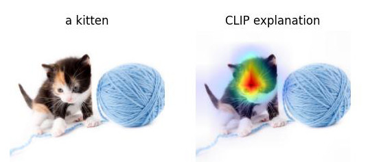

# Simple explainability of image-text similarity with CLIP-ViT and Hugging Face

See the contents of the accompanying [Jupyter notebook](index.ipynb) for a simple implementation of [Chefer et al. (2021)](https://arxiv.org/abs/2103.15679) that works with CLIP-ViT via the Hugging Face API

